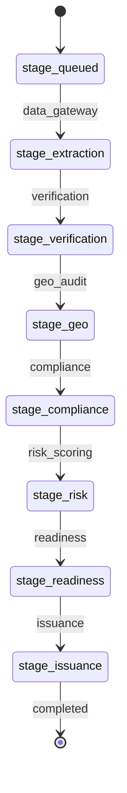

# W3 D3 Graph 통합 및 audit_trail 검증

## 작업 요약

Day3 작업에서는 Day1의 placeholder graph 노드를 팀원들이 만든 실제 노드로 가능한 범위에서 교체하고,
LangGraph Happy Path와 HITL resume 경로가 audit_trail에 정상 기록되는지 확인했다.

이번 작업의 범위는 graph 연결 지점 검증이다. 각 팀원 노드 내부 로직은 새로 작성하지 않고,
이미 존재하는 `backend.agents` 노드만 연결했다. 아직 `backend.agents`에 실제 노드가 없는 단계는
placeholder로 유지했다.

## 변경 사항

- `backend/agents/graph.py`
  - `data_gateway`, `geo_audit`, `compliance`를 실제 노드로 연결.
  - `verification`, `risk_scoring`, `readiness`, `issuance`는 아직 실제 `backend.agents` 노드가 없어 placeholder 유지.
  - graph 노드 실행 시 DB 세션을 넘겨 `audit_trail` 기록이 남도록 wrapper 추가.
  - `document_id`가 없는 smoke test에서는 `data_gateway`가 외부 S3/Bedrock 호출 없이 `stage_extraction`으로 진행하도록 fallback 추가.

- `backend/agents/supervisor.py`
  - `stage_readiness -> issuance`
  - `stage_issuance -> completed`
  - 위 두 route 분기를 추가해 Happy Path가 발행 단계까지 도달하도록 수정.

- `backend/agents/compliance.py`
  - `embed_query` import 경로를 실제 파일 위치에 맞춰 `backend.llm.embedding_factory`로 수정.
  - 최신 main 기준 기존 경로(`backend.infrastructure.embedding_factory`)는 존재하지 않아 graph import 단계에서 실패했다.

## Graph 실행 흐름



`graph.py`의 edge는 이동 가능한 경로를 정의하고, 실제 다음 노드 선택은
`backend/agents/supervisor.py`의 `route(state)`가 담당한다.

## HITL resume 확인

`confidence_score < 0.85`일 때 route는 아래처럼 분기한다.

- `error_reason == "low_confidence"`: `supplier_reverify`
- 그 외 gray zone 또는 risk escalation: `hitl_interrupt`

HITL interrupt 시 `current_stage`는 중단 지점을 유지하고, `batch_status`만
`batch_hitl_wait`로 전환한다. 승인 후 resume되면 `batch_status`는
`batch_processing`으로 복귀하고 같은 `current_stage`부터 이어간다.

## EC2 검증 결과

EC2 `jihye260604` 브랜치에서 graph smoke test를 실행해 아래를 확인했다.

```text
[happy_path]
final_current_stage = stage_issuance
final_batch_status = batch_processing
node_order = data_gateway -> verification -> geo_audit_execute -> geo_audit -> geo_audit -> compliance -> risk_scoring -> readiness -> issuance -> completed
step_numbers = [1, 2, 3, 4, 5, 6, 7, 8, 9, 10]
chain_connected = True

[resume_path]
interrupt_triggered = True
resumed_current_stage = stage_verification
node_order = hitl_interrupt
step_numbers = [1]
chain_connected = True
```

`geo_audit_execute`와 중복된 `geo_audit` 기록은 최신 `geo_audit_node` 내부에서 tool 및 node trace가
함께 남기 때문에 발생한다. 핵심 검증 기준은 `step_number`가 순서대로 증가하고,
각 row의 `prev_hash`가 직전 row의 `output_hash`와 연결되는지이며, 결과는 `chain_connected = True`로 확인했다.

## 확인 기준

- Happy Path가 `stage_issuance`까지 도달한다.
- resume 후 `current_stage`가 중단 stage인 `stage_verification`을 유지한다.
- `audit_trail.step_number`가 1부터 순서대로 쌓인다.
- `prev_hash`가 직전 `output_hash`와 연결된다.
- graph 결합 작업은 실제 존재 노드만 연결하고, 없는 노드는 placeholder로 유지한다.
